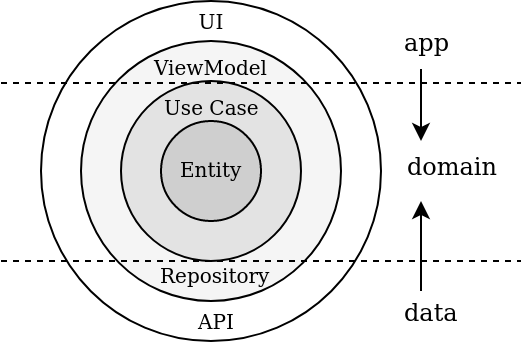
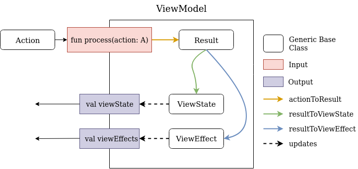

# Wiki Game
The point of the game is to find the target article by using hyperlinks from other articles. Every article is fetched from Wikipedia.

## Modules
The project is broken down into 4 modules

#### app module
The standard entry point to the App, it contains everything related to:
- Android (Activities, Fragments, Views), 
- Presentation layer (ViewModels) 
- Dependency injection (Dagger 2 modules and components)

Because of Dependency injection this module is depends on every other module. Although leaving out the DI, this module does not directly interact with any module besides the **domain module**.

#### domain module
The so called business logic layer that is not dependent on any other module. It contains the UseCases (Interactors) of the App, and the Repository interfaces.

#### data module
This module connects the App to the outside world, in this case it is an API which serves the Wikipedia articles. The only dependency of this module is the **domain module**, in particular the Repository interfaces which are implemented inside this module.



#### test-utils module
A simple utility module that provides common functionality which can be used inside tests of every other module. It's main purpose is to help with the DRY principle inside tests.


## Architecture
The app uses an MVI-like architecture inspired by 
- Kaushik Gopal's talk at Mobilization IX and the accompanying App [movies-usf-android](https://github.com/kaushikgopal/movies-usf-android)
- [Roxie](https://github.com/ww-tech/roxie)
- Jake Wharton's talk [The State of Managing State with RxJava](https://jakewharton.com/the-state-of-managing-state-with-rxjava/)

The data flow inside the App is unidirectional, there is only one entry point (**process** function), and two exit points (**viewState** and **viewEffects**).

### State
Every screen that will have its own ViewModel should define the four base state classes that will be used on that screen.

- **BaseAction** - actions that are send usually from the UI e.g. initialization, user clicks. They define an intent (not the android one) that something in the UI should change. These action can contain data e.g. EditText input.
- **BaseResult** - they are the "result" of transforming an action. For example, a user types something into a search bar and clicks search. A SearchAction is sent into the ViewModel, this starts a search API request, when it fulfills a list is returned. This list is then wrapped with a Result class and sent downstream.
- **BaseViewState** - specifies the whole state of the screen. To change something in the UI the state has to change. This state and everything inside is immutable, this means that every time something changes a new object is created. The Kotlin data class **copy** functions shines here.
- **BaseViewEffect** - one time "effects" that happen in the App. For example, a Toast/Snackbar message or in-app navigation.

### ViewModel

All of the UI data flow logic is orchestrated inside the abstract BaseViewModel class using RxJava2. Just like [Redux](https://redux.js.org/) every state change is preceded with an action. The BaseViewModel provides a public **process** function that takes in an Action. That Action is then saved inside a [BehaviorRelay](https://github.com/JakeWharton/RxRelay) and transformed into a Result (**actionToResult**). Both the **viewState** and **viewEffects** are listening to the Result stream. 

- The **resultToViewState** changes the **viewState** depending on the Result

- The **resultToViewEffect** emits a one time **viewEffect**  that should not be persisted inside the state.

Activities and Fragments listen to the **viewState** and on every emit update the UI according to the state. A **viewEffects** emit "trigger" a one time effect in the App.

The BaseViewModel takes in four generic types each of which implement (**BaseAction**, **BaseResult**, **BaseViewState**, **BaseViewEffect**). Every ViewModel that extends the BaseViewModel and has to provide the four generics along with the **actionToResult**, **resultToViewState**, **resultToViewEffect** functions.


 ```kotlin
private val actions = BehaviorRelay.create<A>()
private val store: Observable<Lce<out R>> by lazy {
        actions.actionToResult()
            .share()
}

fun process(action: A) {
    actions.accept(action)
}
 ```
  ```kotlin
val viewState: Observable<S> by lazy {
    store.resultToViewState()
        .replay()
        .autoConnect(1) { disposables += it }
        .observeOn(AndroidSchedulers.mainThread())
}
 ```
  ```kotlin
val viewEffects: Observable<E> by lazy {
    store.resultToViewEffect()
        .observeOn(AndroidSchedulers.mainThread())
}
 ```
#### LCE
Before **actionToResult** sends the Result down the chain it wraps it with a [LCE](https://tech.instacart.com/lce-modeling-data-loading-in-rxjava-b798ac98d80)
 class. The wrapper class significantly helps with the **L**oading, **C**ontent or **E**rror states that will occur during the lifecycle of the App. Instead of creating a new class for every possible state that can occur in the App, this class gives the ability to express different outcomes by simply wrapping the normal state.
 ```kotlin
sealed class Lce<T> {
    data class Loading<T>(val payload: T) : Lce<T>()
    data class Content<T>(val payload: T) : Lce<T>()
    data class Error<T>(val payload: T) : Lce<T>()
}
 ```
My implementation differs a bit from the one in the article. The Loading class also has a payload passed in, this is needed to differentiate the generic **T** type. Because generics are not reified at run-time there is no way to get the type of a Loading without the payload of that same type.

The Lce is mostly used inside **resultToViewState** to helps with grouping related state management logic.
```kotlin

override fun Observable<Lce<out Result>>.resultToViewState(): Observable<ViewState> {
    return scan(initialState) { state, result ->
        when(result){
            is Lce.Content -> handleResultContent(state, result.payload)
            is Lce.Loading -> handleResultLoading(state, result.payload)
            is Lce.Error -> handleResultError(state, result.payload)
        }
    }.distinctUntilChanged()
}
```
Every **handle** function returns a new state depending in the payload type.